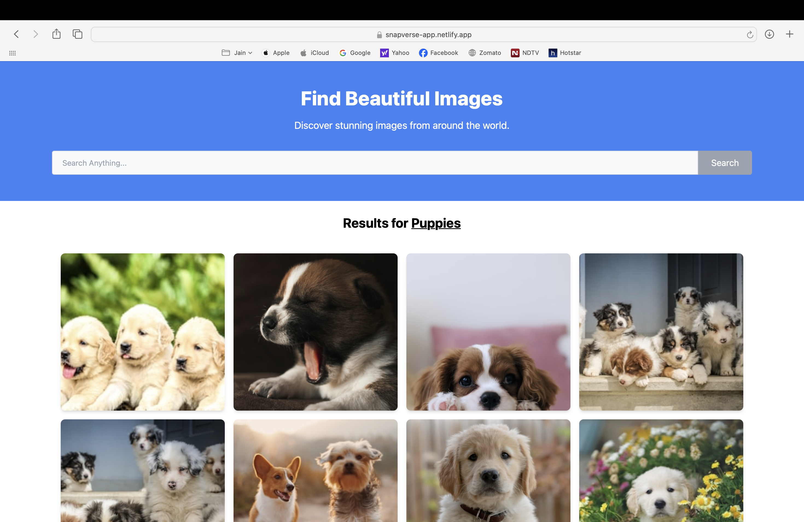

# SnapVerse 🚀

**SnapVerse** is a modern web application that lets users explore, search, and discover a wide range of stunning images.  
Built with a focus on performance, responsiveness, and elegant UI, SnapVerse delivers an immersive visual experience for every user.

---

## ✨ Features

- 🔍 **Image Search**: Search and explore images instantly based on any keyword.
- 📱 **Responsive Design**: Works seamlessly on all devices.
- 🖼️ **Dynamic Grid Layout**: Images displayed in a flexible, responsive layout.
- 🎨 **Tailwind CSS Styling**: Easy and elegant UI customization.
- ⚡ **Fast and Smooth UX**: Optimized performance.

---

## 🛠️ Tech Stack

- **JavaScript**
- **ReactJS**
- **TailwindCSS**
- **Context API** (`createContext`)
- **Axios**
- **Unsplash API** (for image search)

---

## 🚀 Live Demo

Check out the deployed version here:  
🌐 [SnapVerse on Netlify](https://jocular-sprite-109b1d.netlify.app/)

> ⚠️ **Note**: Unsplash API has a rate limit of 50 requests per hour.

---

## 🖥️ UI Preview



---
## 📦 Getting Started Locally

These instructions will help you set up and run the project on your local machine. 
Follow the steps below to get started:

**1. Clone the repository:**

   ```bash
    git clone https://github.com/piyushchhoriya/snapverse.git
   ```
**2. Change to the project directory:**
```bash
    cd snapverse
```

**3. Install the dependencies:**
```bash
    npm install
```
   
**4. Start the development server:**
```bash
    npm start
```
    Open your web browser and visit http://localhost:3000 to see the application running.

## 🎯 Future Improvements

- Integrate advanced search filters (orientation, color, category).
- Add infinite scrolling for seamless image browsing.
- Optimize image loading with lazy loading techniques.
- Explore AI-based image recommendation systems.

---

## 📈 Success Metrics

- Achieve < 1 second initial page load time.
- Deliver accurate and highly relevant image search results.
- Receive positive user feedback and engagement.
- Increase user session times and interaction rates.

---

## 📝 License

This project is licensed under the [MIT License](LICENSE).

---
